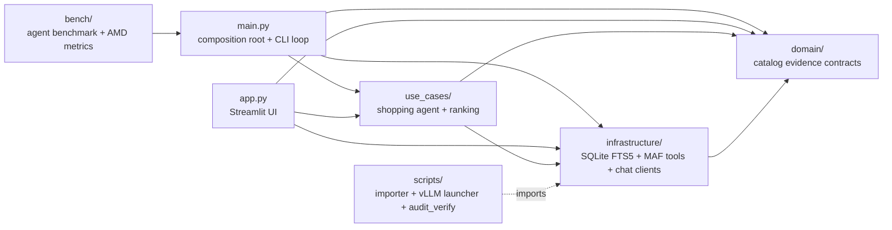
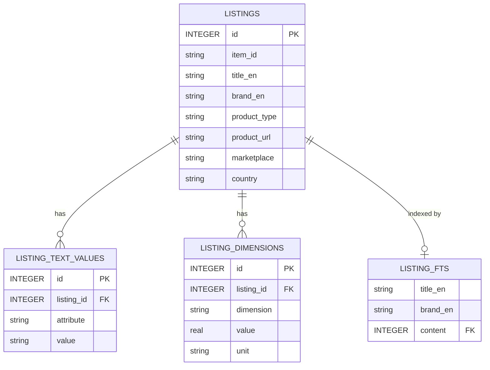
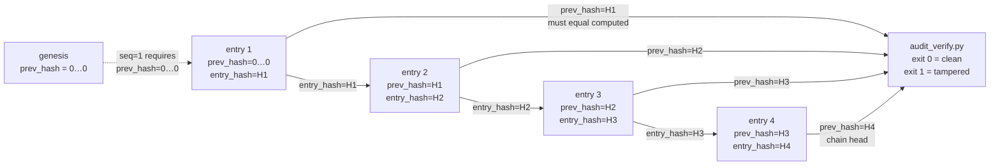
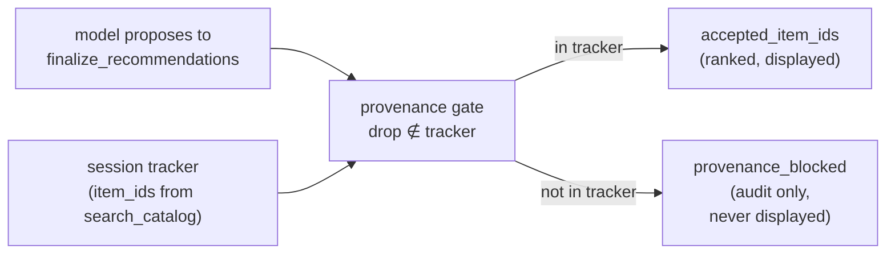

# Architecture

## Layers

The agent receives Microsoft Agent Framework's `OpenAIChatCompletionClient`; vLLM and DeepSeek use the same OpenAI Chat Completions wire protocol.

## Agent and tools

RetailConcierge is one MAF `Agent` responsible for the complete user conversation:

- call `extract_brief` first to produce a structured brief via LLM tool calling
- ask only blocking clarification questions (capped at 2 per turn by the brief tool)
- call `find_product_types` and `find_brands` to canonicalize names against the catalog
- call `search_catalog` to retrieve BM25 candidates
- classify every retrieved item as `exact_product`, `accessory`, `unrelated`, or `uncertain`
- call `finalize_recommendations` for the catalog-provenance gate and deterministic ranking
- explain supported recommendations and evidence gaps

The five MAF tools, in call order:

| Tool | What it does |
|---|---|
| `extract_brief` | LLM fills a `ShoppingBrief` Pydantic model; tool body validates (typed currency / dimension / quantity conversion, vocabulary gate). |
| `find_product_types` | LIKE-match against the `product_type` column, ordered by listing count. |
| `find_brands` | Three-tier resolution: exact prefix → FTS5 → LIKE fallback. Handles misspellings and case. |
| `search_catalog` | BM25 via FTS5, up to 50 candidates with optional type / brand / dimension filters. Records observed `item_id` values into the session's tracker. |
| `finalize_recommendations` | Drops candidates whose `item_id` was not seen by `search_catalog` in this session, keeps only `exact_product`, applies deterministic multi-field ranking. Returns the authoritative order. |

## Conversation

The default path shows products without interruption. Compatibility uncertainty, fundamentally different product interpretations, conflicting explicit constraints, or silent relaxation of a must-have can trigger one question. Missing budget, brand, color, or a nice-to-have does not block useful results.

## Catalog

The Amazon Berkeley Objects (ABO) NDJSON dataset is imported once into `retail_catalog.db`. Raw shards stay outside Git.

FTS5 returns BM25-ordered candidates with optional SQL filters for product type and dimension. `search_catalog` records returned `item_id`s into the session's tracker; `finalize_recommendations` drops anything not seen — invented IDs cannot reach the displayed list. The catalog carries no prices, ratings, popularity, or availability; the system never claims any of those. Implementation: `infrastructure/database.py`, `use_cases/ranking.py`.

## Misspelling, foreign-language, and paraphrase handling

`extract_brief` is the single point per turn where the LLM maps user words to canonical catalog values. Its system prompt includes the catalog's `product_type` and `brand` vocabularies, and the LLM is instructed to canonicalize misspellings, foreign-language input, and paraphrases against that vocabulary. A brief-level Pydantic validator rejects off-vocabulary values so wrong types / brands cannot silently reach `search_catalog`. One tool call handles all four input variations, instead of stacking database-side fuzzy indexes per field. Implementation: `domain/recommendation.py` (validator), `use_cases/shopping_agent.py` (prompt composition); tests in `tests/test_brief_vocabulary_gate.py`.

## Session boundary

The CLI creates one `AgentSession` and reuses it until the user exits. MAF stores the turn history in that session, allowing a clarification answer or refinement to continue the same conversation. The CLI does not persist sessions across process restarts.

## Benchmark

`bench/run_agent_bench.py` creates an independent session per scenario and emits a standardized record set (latency, response kind, recommendation / chip counts, catalog cache hits / misses, AMD GPU / vLLM metrics where available). Implementation: `bench/run_agent_bench.py`.

## Audit log

Every catalog and finalizer tool call writes one entry to an append-only JSONL file. Each entry links to the previous one via `prev_hash`/`entry_hash`; `extract_brief` is not recorded.

Verify with `python scripts/audit_verify.py retail_audit.jsonl` (stdlib only, no project deps). Opt-in via `RETAIL_AUDIT_LOG=./retail_audit.jsonl`. Implementation: `infrastructure/audit.py`, `scripts/audit_verify.py`; tests in `tests/test_audit_log.py`.
