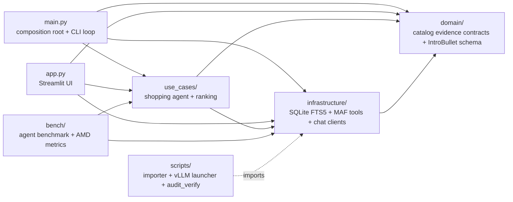
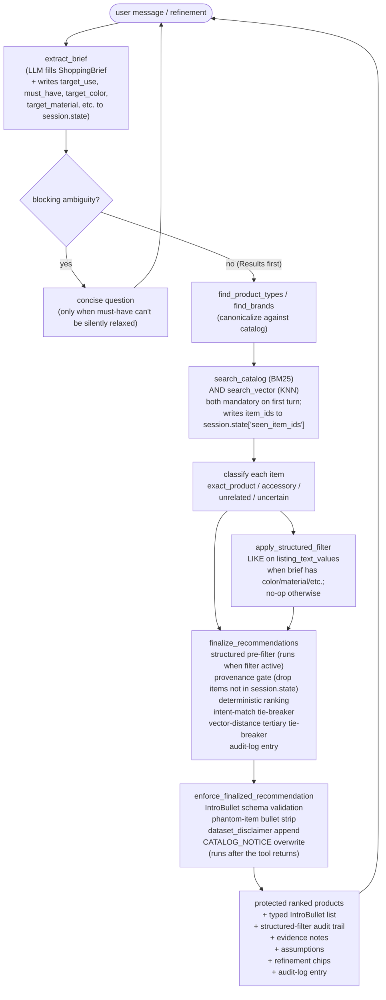
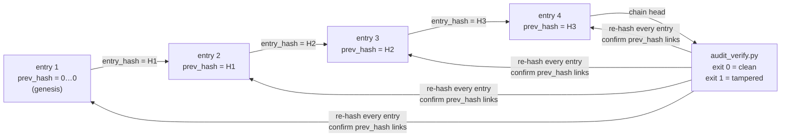
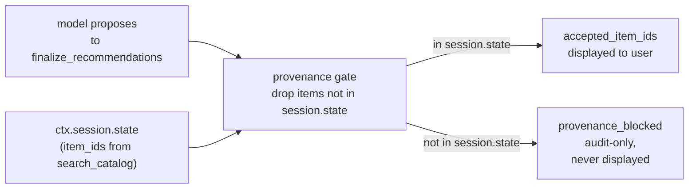

# Architecture

## Layers



The agent receives Microsoft Agent Framework's `OpenAIChatCompletionClient`; vLLM and DeepSeek use the same OpenAI Chat Completions wire protocol.

## Agent and tools

RetailConcierge is one MAF `Agent` responsible for the complete user conversation:

- call `extract_brief` first to produce a structured brief via LLM tool calling
- ask only blocking clarification questions when compatibility, must-have relaxations, or fundamentally different product interpretations are at stake
- call `find_brands` (and `find_product_types` when a type filter would materially narrow the search) to canonicalize names against the catalog
- call `search_catalog` to retrieve BM25 candidates, writing observed `item_id`s into `ctx.session.state`
- classify every retrieved item as `exact_product`, `accessory`, `unrelated`, or `uncertain`
- call `finalize_recommendations` to drop anything not seen by `search_catalog` this session, keep only `exact_product`, apply deterministic weighted ranking with the intent-match tie-breaker, and return a typed candidate list (the `IntroBullet` recommendation list is built by the finalizer guard that runs after the tool returns)
- after `finalize_recommendations`, narrate supported picks and evidence gaps; the finalizer's bullet list is what the shopper sees, not the model's first-pass draft

The five MAF tools, in the order the system prompt asks for:

| Tool | What it does |
|---|---|
| `extract_brief` | LLM fills a `ShoppingBrief` Pydantic model; tool body validates (typed currency / dimension / quantity conversion, vocabulary gate). Writes `target_use`, `must_have`, `target_color`, `target_material`, `target_pattern`, `target_finish_type`, `target_fabric_type`, `target_style` into `ctx.session.state`. |
| `find_product_types` | LIKE-match against the `product_type` column, ordered by listing count. |
| `find_brands` | Three-tier resolution: exact prefix → FTS5 → LIKE fallback. Handles misspellings and case. |
| `search_catalog` | BM25 via FTS5, up to 50 candidates with optional product-type and max-dimension filters (no brand filter parameter; brand resolution happens in `find_brands`). Writes returned `item_id` values into `ctx.session.state['seen_item_ids']`. |
| `search_vector` | Encodes the query with `BAAI/bge-small-en-v1.5` via fastembed (ONNX runtime, no torch dependency, 384-dim unit-norm), KNN against `vec_items` virtual table via sqlite-vec `MATCH ... AND k = N`, returns up to 50 candidates with `item_id` + `distance`. Writes returned `item_id` values into the same `seen_item_ids` set. Joins against `listings` so the returned shape matches `search_catalog`. |
| `finalize_recommendations` | Reads `seen_item_ids` / `target_use` / `must_have` / `target_color` / `target_material` / etc. from `ctx.session.state`. First narrows proposed candidates via `apply_structured_filter` (LIKE on `listing_text_values`, only when the brief has color/material/etc.), then drops anything whose `item_id` was not seen by either `search_catalog` or `search_vector` this session, keeps only `exact_product`, applies deterministic multi-field ranking with the intent-match tie-breaker (and vector-distance tertiary tie-breaker), returns a `dict` payload. The `IntroBullet` recommendation list is built by the finalizer guard (`enforce_finalized_recommendation`) that runs after the tool returns. |

Per-shopper memory lives on the MAF `AgentSession` object — `seen_item_ids`, `target_use`, `must_have`. The CLI creates one `AgentSession` and reuses it across turns; Streamlit's "New Session" button creates a fresh one. Tool-level state (catalog query cache, hits/misses) is module-level in `infrastructure/agent_tools.py` and shared across sessions — it is not per-shopper.

## Conversation



The default path shows products without interruption. Compatibility uncertainty, fundamentally different product interpretations, conflicting explicit constraints, or silent relaxation of a must-have can trigger one question. Missing budget, brand, color, or a nice-to-have does not block useful results.

## Recommendation output contract

The bullet list the shopper sees is a typed list of `IntroBullet` (Pydantic model in `domain/recommendation.py`), not free-form prose. Two closed enums lock the schema:

- `subject`: one of `item`, `brief`, `assumptions`, `catalog_notice`.
- `claim_kind`: one of `color`, `material`, `dimension`, `brand`, `product_type`,
  `intent_match`, `dataset_disclaimer`, `none`. Catalog-absent fact categories
  (`price`, `stock`, `shipping`, `rating`, `warranty`, `discount`) have no slot
  in the enum and are rejected at validation time. No ad-hoc claim category can be emitted.

A pair of cross-field validators enforces invariants:

- `subject='item'` must carry an `item_id`; `subject='brief'` must not.
- `claim_kind='dataset_disclaimer'` must be about the dataset itself.
- `claim_kind='intent_match'` pairs only with `subject='brief'` (the (subject, claim_kind) pair is enforced, not a reference to specific brief fields).

On top of validation, the finalizer applies three runtime guards before the response is returned:

1. A synthetic `dataset_disclaimer` bullet is appended so shoppers
   see "this is a dataset snapshot, not a live storefront."
2. Phantom-item bullets — items the model proposed but that were not
   in `search_catalog` output — are stripped. The provenance gate in
   `finalize_recommendations` already keeps them out of the ranked
   list; this guard keeps them out of the prose bullets too.
3. `catalog_notice` is overwritten with `CATALOG_NOTICE` (the catalog-truth
   constant), so the model cannot paraphrase the disclaimer into a "live
   availability" claim.

Legacy string bullets are coerced into `IntroBullet` via a `BeforeValidator`, so older tool payloads still validate without code changes elsewhere. Implementation: `domain/recommendation.py` (schema + validators), `use_cases/shopping_agent.py` (runtime guards).

### Intent-match tie-breaker

`screen_and_rank_candidates` ranks by a deterministic weighted score (50% FTS5 retrieval relevance + 15% bullet coverage + 15% material presence + 10% brand presence + 10% dimension evidence). The catalog has no price, rating, or stock data, so those signals are not in the ranking. When two candidates tie on that primary score, `_target_use_match_score` supplies a secondary key that prefers the candidate whose `target_use` overlaps the shopper's brief. The primary score is never overridden — the tie-breaker only resolves draws, so the existing ranking contracts stay intact.

## Catalog

The Amazon Berkeley Objects (ABO) NDJSON dataset is imported once into `retail_catalog.db`. Raw shards stay outside Git.

```mermaid
erDiagram
  LISTINGS ||--o{ LISTING_TEXT_VALUES : "has"
  LISTINGS ||--o{ LISTING_DIMENSIONS : "has"
  LISTINGS ||--|| LISTING_FTS : "indexed by"
  LISTINGS ||--|| VEC_ITEMS : "indexed by"

  LISTINGS {
    INTEGER id PK
    string  item_id
    string  title_en
    string  brand_en
    string  product_type
    string  product_url
    string  marketplace
    string  country
  }
  LISTING_TEXT_VALUES {
    INTEGER id PK
    INTEGER listing_id FK
    string  attribute
    string  value
  }
  LISTING_DIMENSIONS {
    INTEGER id PK
    INTEGER listing_id FK
    string  dimension
    real    value
    string  unit
    INTEGER is_normalized
  }
  LISTING_FTS {
    string    title_en
    string    brand_en
    INTEGER   content FK
  }
  VEC_ITEMS {
    string   item_id PK
    blob     embedding
  }
  VEC_INDEX_META {
    string key PK
    string value
  }

Note: `vec_index_meta` is a deliberate sidecar — a key/value table that
records which model + dim + build timestamp produced the vector index.
It has no relationship line into the ER diagram on purpose: it's a flat
KV store, not a normalized entity tied to `listings`.
```

FTS5 returns BM25-ordered candidates with optional SQL filters for product type and dimension. `search_catalog` records returned `item_id`s into the session's `ctx.session.state`; `finalize_recommendations` reads that state and drops anything not seen — invented IDs cannot reach the displayed list or the bullet list. The catalog carries no prices, ratings, popularity, or availability; the IntroBullet `claim_kind` enum reflects this. Implementation: `infrastructure/database.py`, `use_cases/ranking.py`.

### Vector index (sqlite-vec)

A second retrieval path stores 384-dim BGE-small-en-v1.5 embeddings (BAAI/bge-small-en-v1.5, Apache-2.0) for every active listing in a `vec_items` virtual table (sqlite-vec extension, brute-force KNN — adequate at demo scale, ~50ms across 145k rows). The index is built once via `scripts/build_vector_index.py` after `import_catalog.py`; the catalog is treated as immutable so there is no reindex path.

Embedding input per listing (built in SQL to avoid loading 11M text_value rows into Python):

```
LOWER(TRIM(
  title_en ||
  '. ' || brand_en ||
  '. ' || GROUP_CONCAT(first-3 bullet_point values, '. ') ||
  ', ' || GROUP_CONCAT(first-5 item_keywords, ', ')
))
```

Bullets and keywords carry the merchant's own natural-language description of the product — that's where the cleanest semantic signal lives. Title and brand are appendices. Empty / null values are skipped (the build script skips rows whose embedding text is empty to avoid polluting KNN with the mean vector).

`search_vector` encodes the query with the same BGE-small-en-v1.5 model at tool-call time and runs `SELECT ... WHERE embedding MATCH ? AND k = N ORDER BY distance`. Cosine distance on unit-norm vectors is in [0, 2]; lower is better. The tool joins `vec_items` against `listings` to return the same listing-shape `search_catalog` does, so the rest of the agent pipeline is backend-agnostic.

Both `search_catalog` and `search_vector` write the returned `item_id`s into the same `ctx.session.state['seen_item_ids']` set, so the provenance gate in `finalize_recommendations` works unchanged. The vector distance is recorded as a secondary tie-breaker in the ranker — it never overrides the BM25-first primary score.

The `vec_index_meta` sidecar table records the model name, embedding dimension, and build timestamp so future-you can tell when the index was built and with what. Implementation: `scripts/build_vector_index.py`, `infrastructure/database.py` (`vec_items`, `vec_index_meta`, `encode_query`, `search_vector`).

### Structured attribute filtering

Industry-standard e-commerce pattern (Algolia, Bloomreach, Elastic, Amazon's hybrid search): recall candidates from BM25 + vector are pre-filtered against structured attributes (color, material, pattern, finish_type, fabric_type, style) via SQL `LIKE` matching against `listing_text_values.value`. The catalog IS the synonym dictionary — user-typed "red" returns every listing whose `color` value contains "red" as a substring. New merchant-written color names are covered automatically without a curated synonym list.

`ShoppingBrief` carries optional `color`, `material`, `pattern`, `finish_type`, `fabric_type`, `style` fields. The LLM populates them from the user's words in `extract_brief`; `extract_brief` writes them to `ctx.session.state['target_color']`, `target_material`, etc. `finalize_recommendations` reads these and calls `repository.apply_structured_filter(candidates, color=..., material=..., ...)`. The filter narrows the proposed candidate list to those matching every specified attribute via `LIKE %term%` on `listing_text_values` — candidates that don't match are dropped (not down-ranked: a sofa that isn't red is not "less relevant," it's a misread).

This is a pre-filter, not a post-filter or embedding-into-vector pattern. Embedding attribute values into the vector pollutes the semantic space with attribute NAMES ("color:") and degrades recall for queries that don't specify those attributes. Post-filter loses recall — top-50 vector hits may not include enough "red velvet" matches to fill the result list. Pre-filter on selective attributes (color=maroon at 0.2% of the catalog) is what production search engines do. Implementation: `infrastructure/structured_filter.py`, `infrastructure/database.py` (`apply_structured_filter`), `use_cases/shopping_agent.py` (finalize pre-filter step).

The filter does NOT embed into the vector and does NOT alter the ranking weights. It runs in the `finalize_recommendations` tool, before `screen_and_rank_candidates`, and reports the filtered-out IDs in the audit log so the provenance story stays intact.

## Misspelling, foreign-language, and paraphrase handling

`extract_brief` is the single point per turn where the LLM maps user words to canonical catalog values. The catalog's `product_type` and `brand` vocabularies reach the model via `CatalogVocabularyProvider` (see paragraph below), and the LLM is instructed in `SHOPPING_AGENT_INSTRUCTIONS` to canonicalize misspellings, foreign-language input, and paraphrases against that vocabulary. A brief-level Pydantic validator rejects off-vocabulary values so wrong types / brands cannot silently reach `search_catalog`. One tool call handles all four input variations, instead of stacking database-side fuzzy indexes per field. Implementation: `domain/recommendation.py` (validator), `use_cases/shopping_agent.py` (prompt composition); tests in `tests/test_brief_vocabulary_gate.py`.

The catalog vocabulary itself is injected per turn through a `CatalogVocabularyProvider` (MAF `ContextProvider`, registered via `Agent(context_providers=[...])`), not baked into the static `instructions=` payload. This is the Microsoft-recommended "Context Engineering" pattern: ADR `docs/decisions/0016-python-context-middleware.md` names `ContextProvider` as the canonical abstraction and the upstream sample `python/samples/02-agents/context_providers/simple_context_provider.py` (`UserInfoMemory`) demonstrates the same shape for per-session dynamic context. The provider state lives on the same `AgentSession.state` object the rest of the per-shopper memory uses, so the rule "don't keep bespoke closure-captured state" stays intact. The brief-time Pydantic validator and the per-turn `ContextProvider` share one vocabulary list at process-boot time so the GATE (validator) and the HINT (provider prompt) cannot drift apart. Implementation: `infrastructure/catalog_vocabulary_provider.py`, `tests/test_catalog_vocabulary_provider.py`.

## Session boundary

The CLI creates one `AgentSession` and reuses it until the user exits. MAF stores the turn history in that session, allowing a clarification answer or refinement to continue the same conversation. Between turns of the same conversation, `seen_item_ids`, `target_use`, and `must_have` are popped on `ctx.session.state` so each new user message starts with a clean provenance scope and the tie-breaker does not read stale intent. The next `extract_brief` call rewrites `target_use` / `must_have` from the new user message. The CLI does not persist sessions across process restarts. Streamlit uses the same `AgentSession` object per active chat; "New Session" creates a fresh one.

## Benchmark

`bench/run_agent_bench.py` creates an independent session per scenario and emits a standardized record set (latency, response kind, recommendation / chip counts, catalog cache hits / misses, AMD GPU / vLLM metrics where available). Implementation: `bench/run_agent_bench.py`.

## Audit log

A judge, regulator, or customer can ask: *"What did the concierge actually access in this session, and can a third party prove it without trusting our codebase?"* The audit log answers both questions: every catalog or finalizer tool call writes one entry to an append-only JSONL file, and the entries form a tamper-evident hash chain verifiable by a stdlib-only script.

### Hash chain (one entry per tool call)

Each entry links to the previous via `prev_hash`/`entry_hash`. Edit any line, delete any line, or reorder any line — and `audit_verify.py` exits 1 with the offending line number.



### Provenance gate artifact (what gets logged per finalize call)

When `finalize_recommendations` runs, the log records the full picture: every item_id the model proposed, every item_id that survived the gate, and — crucially — every item_id the model tried to slip in that wasn't actually returned by `search_catalog` in this session. A clean log has empty `provenance_blocked`; a populated one is the audit story. The "seen this session" set is read from `ctx.session.state['seen_item_ids']`.



Opt-in via `RETAIL_AUDIT_LOG=./retail_audit.jsonl`. Verify with `python scripts/audit_verify.py retail_audit.jsonl` (stdlib only, works on the demo droplet without a venv). Implementation: `infrastructure/audit.py`, `scripts/audit_verify.py`; tests in `tests/test_audit_log.py`.
