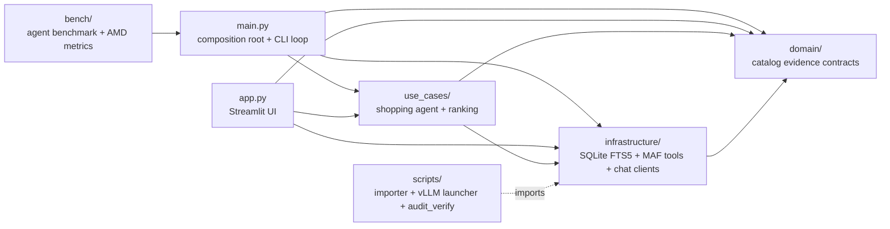
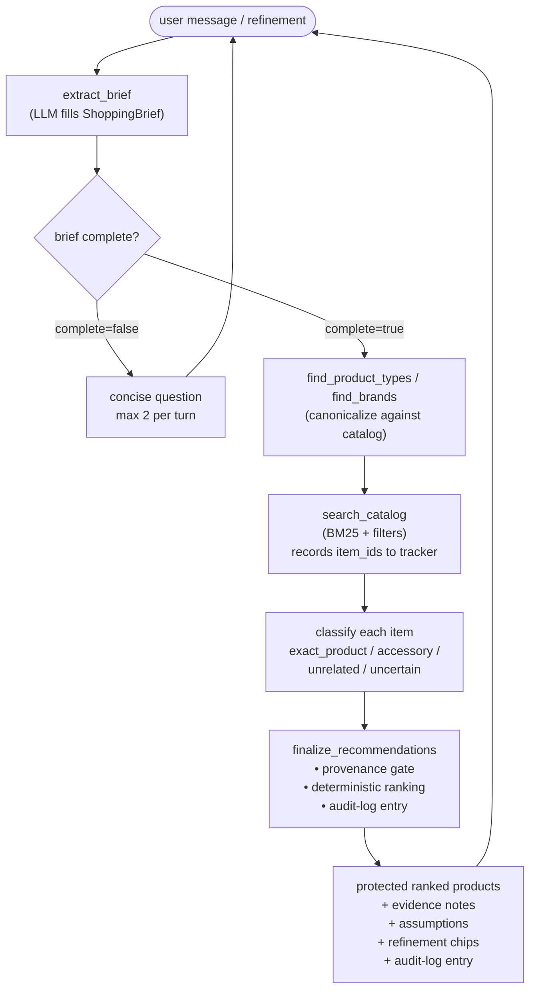
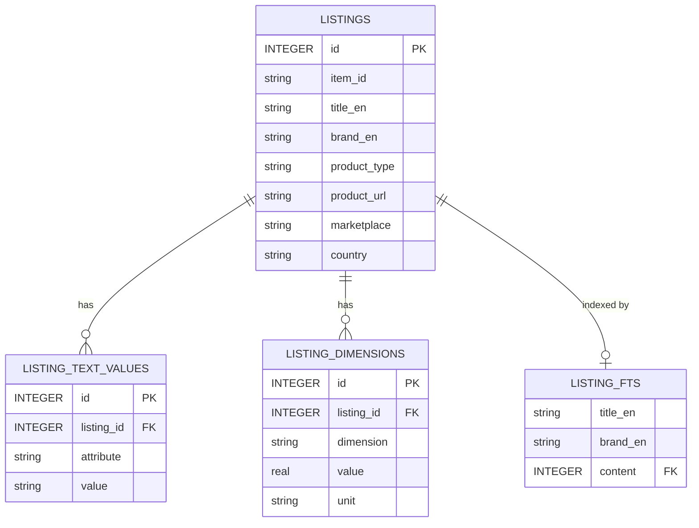
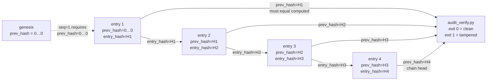
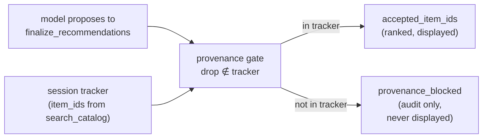

# Architecture

## Layers

The agent receives Microsoft Agent Framework's `OpenAIChatCompletionClient`; vLLM and DeepSeek use the same OpenAI Chat Completions wire protocol.

## Agent and tools

RetailConcierge is one MAF `Agent` responsible for the complete user conversation:

- call `extract_brief` first to produce a structured brief via LLM tool calling
- ask only blocking clarification questions (capped at 2 per turn by the brief tool)
- call `find_product_types` and `find_brands` to canonicalize names against the catalog
- call `search_catalog` to retrieve BM25 candidates
- classify every retrieved item as `exact_product`, `accessory`, `unrelated`, or `uncertain`
- call `finalize_recommendations` for the catalog-provenance gate and deterministic ranking
- explain supported recommendations and evidence gaps

The five MAF tools, in call order:

| Tool | Description |
|---|---|
| `extract_brief` | LLM args. Agent fills a `ShoppingBrief` Pydantic model (intent, search_terms, product_type, brand, budget_usd converted to USD, max_dimension_cm converted to cm, must_have, nice_to_have, color, material, compatibility, target_use, quantity, assumptions, evidence_gaps) via MAF tool calling. Tool body returns the validated brief dict. No database access, no offline parsing — the LLM owns field extraction. |
| `find_product_types` | LIKE-match against the `product_type` column, ordered by listing count. |
| `find_brands` | Three-tier brand resolution: exact prefix → FTS5 (stemming + close misspellings) → LIKE fallback. |
| `search_catalog` | BM25 via FTS5, up to 50 candidates with optional product-type, brand, and dimension filters. Records observed `item_id` values into the session's `CatalogEvidenceTracker`. |
| `finalize_recommendations` | Drops candidates whose `item_id` was not observed by `search_catalog` in the current session, keeps only `exact_product`, applies deterministic multi-field ranking, and returns the authoritative order. |

## Conversation

The default path shows products without interruption. Compatibility uncertainty, fundamentally different product interpretations, conflicting explicit constraints, or silent relaxation of a must-have can trigger one question. Missing budget, brand, color, or a nice-to-have does not block useful results.

## Catalog

The Amazon Berkeley Objects (ABO) NDJSON dataset is imported once into `retail_catalog.db`. Raw shards stay outside Git.

SQLite FTS5 searches title and brand and returns up to 50 candidates in BM25 order. SQL can apply exact product-type and dimension filters first. Product identity is then screened semantically by the agent; keyword blacklists are not used.

Each `search_catalog` call records the returned `item_id` values into the session's `CatalogEvidenceTracker`. The agent's `finalize_recommendations` tool drops any candidate whose `item_id` was never observed by `search_catalog` in the current session, so invented or hallucinated IDs cannot enter the displayed list. The candidate order produced by the finalizer is authoritative.

Eligible candidates are ordered deterministically by:

- 50% FTS5 relevance
- 15% bullet coverage
- 15% material presence
- 10% brand presence
- 10% dimension evidence

The catalog contains no prices, ratings, review counts, popularity data, or live availability. The system never claims those facts.

## Session boundary

The CLI creates one `AgentSession` and reuses it until the user exits. MAF stores the turn history in that session, allowing a clarification answer or refinement to continue the same conversation. The CLI does not persist sessions across process restarts.

## Benchmark

`bench/run_agent_bench.py` creates an independent session for each scenario and records:

- end-to-end latency
- clarification or recommendation response kind
- recommendation and refinement-chip counts
- catalog-tool cache hits and misses
- AMD GPU snapshots when available
- vLLM metrics when available

## Audit log

Every catalog and finalizer tool call writes one entry to an append-only JSONL file. Each line is JSON with `seq`, `ts`, `session_id`, `tool`, `args`, `result_meta`, `prev_hash`, and `entry_hash` where `entry_hash = sha256(canonical_json(entry_without_entry_hash))`. Each entry's `prev_hash` links to the previous entry's `entry_hash`; the chain head is the most recent `entry_hash`. Genesis is 64 zeros. `canonical_json` is deterministic (sorted keys, UTF-8, no ASCII escapes, NaN/Inf rejected) so equal entries always hash equal.

Four tools are recorded: `find_product_types`, `find_brands`, `search_catalog`, and `finalize_recommendations`. `extract_brief` is not recorded — it has no external-data semantics. Each call uses a single write with `fsync`, so the file on disk always reflects the last completed entry. The logger holds a process-level lock around writes and refuses to reopen over a corrupt tail.

The logger is opt-in. Set `RETAIL_AUDIT_LOG=./retail_audit.jsonl` (or any path) to enable; leave unset for no behavior change. The `main.py` and `app.py` composition roots construct an `infrastructure.audit.AuditLogger` only when the environment variable is present, and pass it through `build_tools` and `build_shopping_agent`.

`finalize_recommendations` records three fields that matter for the audit story:

- `proposed_item_ids` — every item_id the model fed to the tool this call.
- `accepted_item_ids` — what survived the provenance gate and ranking, in authoritative order.
- `provenance_blocked` — `proposed - tracker.snapshot()`, i.e. item_ids the model tried to put on the list that were not actually returned by `search_catalog` in this session. Empty list means the model stayed within the catalog.

A separate `provenance_blocked` field is the only artifact that proves the gate had anything to catch, and the hash chain is what proves the log itself was not edited afterwards.

Verify with `python scripts/audit_verify.py retail_audit.jsonl` (stdlib only, no project deps, works on the demo droplet without a venv). Exit 0 means the chain is intact; exit 1 means a violation was found (line edit, line delete, reorder, or seq skip). `--summary` emits a machine-readable JSON report.
